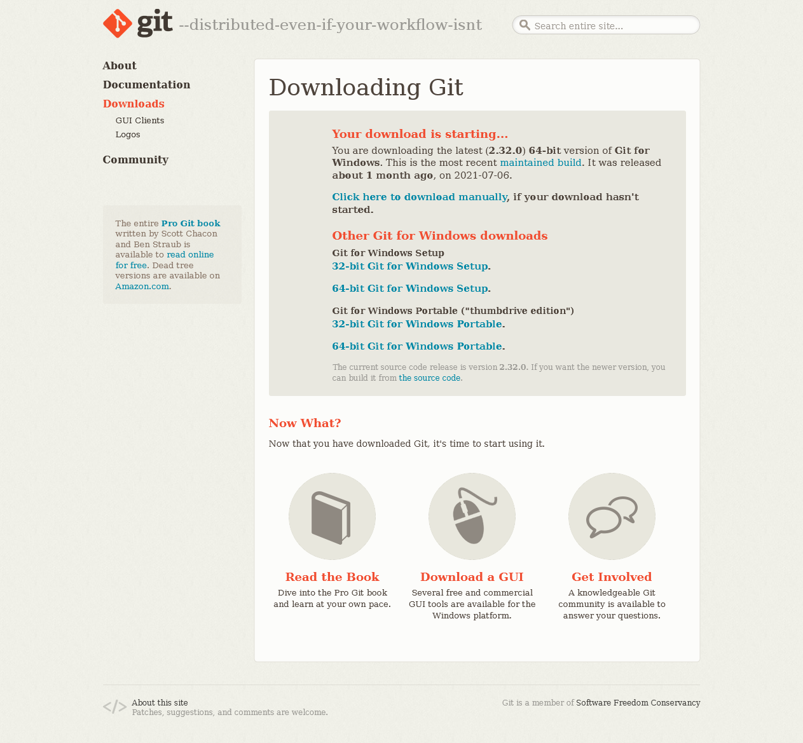
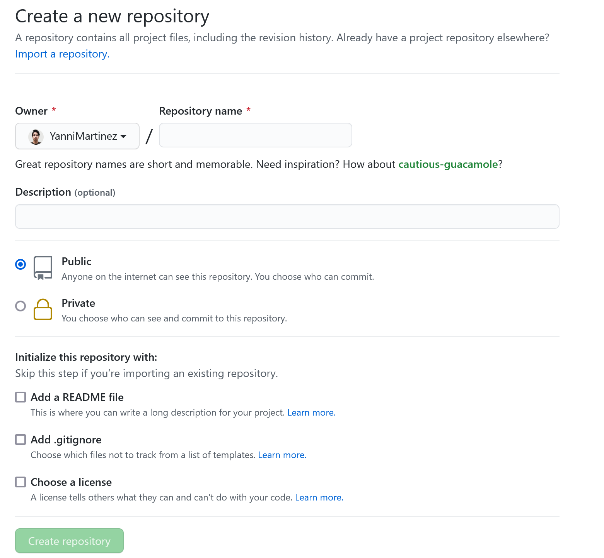

# Aprende a usar un control de versiones más rápido que hacer un café:

## **Contenido**:

* [¿Qué es un sistema de control de versiones?](#qué-es-un-control-de-versiones). :hammer:
* [Consejos antes de iniciar](#consejos-antes-aprender-git).:hatching_chick:
* [¿Cómo empezar a usar git?](#cómo-empezar-a-usar-git).:hatched_chick:
* [¿Cómo instalar Git?](#instalando-git):inbox_tray:
* [Comandos básicos en consola](#comandos-básicos-en-consola).:space_invader:
* [Comandos básicos en git](#comandos-básicos-en-git). :book:
* [Trabaja con Git de forma Local](#trabaja-con-git-de-forma-local). :bust_in_silhouette:
* [¿Cómo trabajar con Git & GitHub?](#cómo-trabajar-con-git--github) :hamster:
* [Trabaja con Git & GitHub en equipo](#trabaja-con-git--github-en-equipo) :busts_in_silhouette:
* [Glosario de Términos de Git y GitHub](#glosario-de-términos-de-git-y-gitHub)

## **¿Qué es un control de versiones?**

Enfocandolo al mundo de la programación, los sistemas de control de versiones son herramientas que ayudan a gestionar los cambios en un archivo o código fuente a lo largo del tiempo. Estas herramientas nos permiten tener un orden de los cambios realizados.
¿Te ha pasado que tienes muchisimas versiones de un proyecto o trabajo? Es probable que almenos 1 vez ocurrió por miedo a no perder el avance cuando algo estaba bien, funcionaba o simplemente era otra alternativa. Un controlador de versiones permite hacer eso sin tener que hacer decenas de copias del mismo proyecto y además puede llegar a fusionar los cambios que existen entre una versión y otra.

### *Evita hacer esto usando un sistema de control de versiones:*

<div align="center"></div>

## **Sistema de control de versiones - GIT**

Es un sistema de control de versiones de código abierto y usado por millones de personas a lo largo de mundo, en este caso veremos como usarlo de forma local y en GitHub para tenerlo en la web, además veremos como trabajar de forma individual y coolaborativa.

## **Consejos antes aprender GIT:**

* Contar con una computadora.
* Crear una cuenta en [GitHub](https://github.com/signup?ref_cta=Sign+up&ref_loc=header+logged+out&ref_page=%2F&source=header-home) (Opcional) pero si quieres exponer tus proyectos o trabajar de forma coolaborativa te aconsejo hacerlo.
* Tener un correo electrónico **tuyo** y que no olvidarás porque los cambios que hagas en los archivos serán firmados con información de ese correo (Posteriormente puede cambiarse el correo, pero es aconsejable establecer uno).


# **¡Empecemos!**


## **¿Cómo empezar a usar Git?**

Dirigete al sitio oficial de Git presionando [aquí](https://git-scm.com/), te desplegará una página como la siguiente:

<div align="center"></div>

Dirigete al monitor que aparece a la derecha y presiona en "Download for" en este caso es un SO Windows, sin embargo, el sitio web sabrá  que sistema operativo tienes. 

<div align="center"></div>

Comienzará a descargarse el instalador, sólo espera un momento a que finalice este proceso.

O bien, si necesitas alguna otra versión de git presiona en donde dice "Downloads" en la barra lateral izquierda y selecciona la que mejor se ajuste a las caracteristicas de tu sistema operativo.

<div align="center"></div>

## **Instalando Git:**

Una vez que haya finalizado la descarga podremos instalar git en nuestro equipo. Da doble click sobre el elemento que se descargó, esa acción te desplegará una ventana como la siguiente:

<div align="center"></div>

Lee los *terminos y condiciones*
 del uso de *git* y presiona en **siguiente**, esto te mostrará lo siguiente:

<div align="center"></div>

Te recomiendo dejar las opciones seleccionadas por defecto. Presiona **siguiente** para seguir con el proceso de instalación.

<div align="center"></div>

Verás la siguiente ventana donde te pregunta el editor de código que usarás con git. Si aún no sabes que editor usarás, te recomiendo que dejes seleccionado **Vim**, esto no significa que siempre trabajarás con Vim, sino que sólo será el editor por defecto, más adelante podrás usar git en cualquier otro editor.
Presiona **siguiente**

<div align="center"></div>

Te recomiento que en este apartado presiones la opción de abajo y coloques **main** este nombre será el que adopte la rama principal de trabajo. (este nombre es libre de jerarquias y clasismos con respecto a master). Presiona **Siguiente**.

<div align="center"></div>

Mantén seleccionada la tercera opción para que puedas hacer uso de Git mediante cualquier otra terminal y no sólo desde la Git Bash que nos generará al final de esta instalación. Presiona **siguiente**.

<div align="center"></div>

Te recomiendo dejar la opción por defecto y dar **siguiente** en las proximas 6 ventanas.

<div align="center"></div>

En la ultima ventana sólo presiona **instalar** y espera a que este proceso termine.

### ¡Felicidades! Ya instalaste Git.

## **Comandos básicos en consola**

| Comando | Acción |
| --- | --- |
| `cd nombreCarpeta` | Se posiciona dentro de la carpeta con el nombre especificado |
| `cd ..` | Retrocede a una carpeta anterior de la que se está posicionada |
| `mkdir nombreCarpeta` | Crea una carpeta con el nombre indicado |
| `ls` (SO basado en Linux) | Lista todos los elementos que se encuentran en esa carpeta o directorio |
| `dir` (SO basado en Windows) | Lista todos los elementos que se encuentran en esa carpeta o directorio |

## **Comandos básicos en Git**

| Comando | Acción |
| --- | --- |
| `git --version` | Permite conocer la versión de git en el equipo |
| `git config --global user.name "Tu nombre"` | Permite establecer el nombre que queremos en git |
| `git config --global user.name "Tu nombre"` | Permite establecer el un nombre en git|
| `git config --global user.username "Tu nombre"` | Establece el nombre de username (Aquí colocarás el mismo nombre de usuario que colocaste al crear tu cuenta en GitHub) |
| `git config --global user.email "tuemail@example.com""` | Permite establecer el correo electrónico en la configuración de git (Si creaste tu cuenta en GitHub coloca el correo con el que creaste la cuenta) |
| `git init` | Permite inicializar git en esa carpeta |
| `git status` | Lista archivos nuevos, modificados o que no han sido relacionados aún a git |
| `git add nombreArchivo` | Agrega ese archivo al sistema de control de versiones git. Al hacerlo, git habrá referenciado los nuevos cambios |
| `git add .` | Agrega esos archivos al sistema de control de versiones git. Al hacerlo, git habrá referenciado los nuevos cambios |
| `git diff` | Nos muestra los cambios que hubo al agregar el archivo modificado. Muestra las modificaciones |
| `git commit -m "descripción"` | Git guarda los cambios hechos hasta ese momento (imaginatelo como guardar la partida en un videojuego) donde dice descripcion deberás describir la funcionalidad de los nuevos cambios, preferentemente no mayor a 50. caracteres|
| `git log` | Lista todos los commits hechos hasta la fecha|
| `git remote add origin EnlaceURL"` | Conecta nuestro repositorio local con uno externo, en este caso puede ser el enlace a un repositorio en GitHub.|
| `git remote -v` | Sirve para obtener información sobre la conexión que tiene el repositorio, normalmente se usa para verificar que está conectado correctamente.|
| `git push origin main/master` | Permite enviar los cambios del repositorio local al repositorio en GitHub, colocarás **main** ó **master** según el nombre que le hayas puesto en la instalación.|
| `git push origin nombreRama` | Permite enviar los cambios del repositorio local al repositorio en GitHub sobre la rama de ese nombre.|

## **Trabaja con Git de forma Local:**

* Crea una carpeta sobre la que estarás trabajando (sólo si apenas trabajaras un nuevo proyecto, sino sólo ve al paso que siguente).
* Posicionate en la carpeta trabajo mediante GitBash.
```
cd nombre_Carpeta
```
* Inicializa un repositorio con el comando `git init`.

```
$ git init
```

* Ejecuta el comando `git status` cada que hagas un cambio o añadas un nuevo archivos, este comando te listará los archivos que cumplan con ello. Si no tienes ningún archivo o aún no haces cambios te mostrará un mensaje como el siguiente: 

```
On branch main
nothing to commit, working tree clean
```

* Si tienes archivos listados en `git status` entonces ejecuta `git add nombreArchivo` ó `git add .` para agregar todos los archivos con modificaciones.

```
git add nombreArchivo

ó

git add .
```

* Realiza un guardado de tus cambios con un commit. Los commit llevan una breve descripción de lo que se hizo, por ejemplo: "Se corrigió un bug en...", "Se incorporó un menú", etc.

```
git commit -m "Descripción breve del funcionamiento"
```

* Si quieres ver los commit's que has hecho entonces usa `git log` que listará los commits realizados en ese repositorio.

```
git commit -m "Descripción breve del funcionamiento"
```

### ¡Con los pasos anteriores ya puedes trabajar de forma local sin problema!

## **¿Cómo trabajar con Git & GitHub?**

Para ello deberás tener una cuenta creada, si aún no la has creado presiona [aquí](https://github.com/signup?ref_cta=Sign+up&ref_loc=header+logged+out&ref_page=%2F&source=header-home).

* Dirigete al menú de GitHub e identifica el botón "new repository" o un equivalente, acontinuación te verás una imagen ilustrativa al respecto:

<div align="center"></div>

* Una vez que hayas presionado ahí te redigirá a la siguiente pantalla:

<div align="center"></div>

Aquí pondrás el nombre que quieres que tenga tu repositorio, puedes poner una ligera descripción acerca de lo que trata, poner la visibilidad pública o privada y decidir si agregar algunos archivos importantes como: `readme`(donde explicas a detalle tu proyecto), `gitignore`(indica los archivos que no subirá al repositorio) y `license`(Es el archivo que explica todos los terminos y condiciones al usar un proyecto).

* Llena el repositorio a tu gusto, en mi caso sólo puse lo siguiente:

<div align="center"></div>

Presiona en **Crear repositorio**

* En esta ventana verás información interesante, que nos permitirá conectar un repositorio de GitHub con uno local, en este tutorial tomaremos la segunda sección que dice "…or push an existing repository from the command line" y copiaremos la primer línea de comandos (Asegurare de tener en la parte de arriba seleccionada la opción HTTPS como se ve en la imagen):

```
git remote add origin https://github.com/YanniMartinez/Aprende-Git-en-5-Minutos.git
```

<div align="center"></div>

* Repite los pasos de la sección anterior llamada "Trabaja de forma local con Git" o en ese mismo repositorio haz lo siguiente:

<div align="center"></div>

* Para verificar que se realizó correctamente la conexión ejecuta `git remote -v`

<div align="center"></div>

* Si te listó 2 elementos ¡lo hiciste bien!

* Ahora sólo nos falta enviar los cambios locales al repositorio en GitHub, para ello ejecutamos el comando `git push origin main` ó `git push origin master` según como hayas configurado la instalación (en mi caso será `main`). Si es la primera vez que usas Git con GitHub te pedirá iniciar sesión para comprobar que eres tú el dueño de la cuenta (Si te da error verifica que hayas colocado nombre de usuario y correo al configurar tu Git, esto puedes consultarlo en los primeros pasos del manual).

<div align="center"></div>

### Actualiza el sitio web de GitHub y ¡listo! Ya enviaste los archivos de un sitio local a tu GitHub.

## Trabaja con Git & GitHub en equipo :

* Alguien del equipo deberá crear un repositorio sobre el que trabajarán (en GitHub).
* Una vez que conoces el repositorio sobre el que trabajarás tienes 2 caminos: 
* * Hacer **Fork** del proyecto (Es el método más recomendado para procesos de trabajo largos)
* * Clonar directamente el repositorio.
* Una vez que hayas elegido el camino lo que deberás hacer es irte a la sección que dice `Code` y copiar el enlace que nos proporcionar GitHub.
* Dirigete a tu `git bash` y posicionate en una carpeta en la que te sientas cómodo.
* Posicionado en el lugar correcto ingresa el siguiente comando:
```
git clone direcciónRepositorioProvenienteDelBotonCODE
```
* El comando anterior descargará todos los archivos del repositorio que le indicamos y creará una carpeta (ingresa a esa carpeta).
* Cuando estés dentro del repositorio te darás cuenta porque dirá algo como lo siguiente:
```
usuer@Desktop MINGW64 ~/ rutaRelativaDelDirectorio (main/master)
```
* Puede listar los archivos de la carpeta con el comando `ls`
* Ya que se verificó que la clonación se realizó correctamente entonces es hora de **crear una rama**, el motivo de crear una rama es para que todos los cambios efectuados sean sobre un "camino separado" y no directamente sobre el flujo principal (esto permite evitar conflictos a largo plazo y trabajar en tareas específicas), para crear una rama usamos el comando `git branch nombreDeLaRama` y posteriormente cambiaremos de la rama principal con el comando `git checkout nombreDeLaRama`. Esto se vería de la siguiente manera:
```
usuer@Desktop MINGW64 ~/ rutaRelativaDelDirectorio (main/master)
git branch nombreDeLaRama
git checkout nombreDeLaRama

usuer@Desktop MINGW64 ~/ rutaRelativaDelDirectorio (nombreDeLaRama)     //Verá entre parentesis el nombre de la rama
```
* Cuando estés posicionado en tu rama ahora es posible hacer todos los cambios que necesites, y podrás hacer los comandos básicos, a continuación te mostraré los comandos o el orden que suele existir:
```
git status
git add .
git status (Para verificar los cambios)
git commit -m "Descripción de lo que hacen los cambios anteriores"
```
* Aquí no será necesario ejecutar el comando `git remote add UrlRepositorio` porque al clonar ya la incluye, incluso puedes verificarlo ejecutando el comando `git remote -v`
* Una vez que tengas los cambios y el o los commit's hechos y quieras mandar estos cambios a GitHub, lo que harás es ejecutar el siguiente comando:
```
usuer@Desktop MINGW64 ~/ rutaRelativaDelDirectorio (nombreDeLaRama) 
git push origin nombreDeLaRama
```
* Presta atención, el comando anterior lo que hará es enviar los cambios a la rama indicada y no en la rama main, esto permite tener los cambios "aislados" del flujo principal evitando problemas, es decir, sólo ocurren dentro de la rama.
* Dirigete al repositorio en GitHub y verás un botón que dice `create pull request`. Una pull request es una solicitud de cambio que sólo el propietario o administrador del repositorio aceptará.
* **¡Listo, sólo espera a ver si tus cambios son aceptados!** Con esto ya estás trabajando en equipo.
* Si quisieras actualizar los cambios en tu repositorio local lo que debes hacer es ejecutar el comando:
```
git pull origin main
```
* Si no te permite actualizar el repositorio te marcará el problema, trata de solucionarlo y vuelve a intentar el comando.
* Si hiciste un Fork, dirigete al repositorio ubicado en tu perfil y presiona donde dice `fetch upstream` eso actualizará el repo de tu perfil con todos los nuevos cambios que existan en el repo original de la persona.

## Glosario de Términos de Git y GitHub
| Término | Significado o uso |
| --- | --- |
| `Status` | Indica el estado actual del repositorio |
| `Commit` | Indica el punto de guardado de un cambio. Contiene un identificador, un mensaje, una fecha de creación, la firma de quien realiza el commit y el nombre que le fue dado a ese commit.  |
| `Push` | Hace alución a empujar algo, es decir, lo que hace es enviar los archivos o cambios modificados a un repositorio |
| `Pull` | Hace alución a jalar algo, es decir, lo que hará es jalar los cambios que existen en el repositorio original, permitirá actualizar los datos. |
| `Pull Request (PR)` | Es una solicitud de cambio que hace la persona que efectuó cambios en el código. La PR sólo será aceptada unicamente por la persona con rol de administrador dentro del repositorio, esta persona verificará el código y lo aceptará o rechazará en función de lo que se necesite en el proyecto.|
| `Rama` | Hace referencia al flujo de trabajo, son utilizadas para que los cambios no se vean reflejados en el flujo principal del proyecto, permite abordar tareas separadas, permite evitar bugs y un orden en caminos que puede tomar el proyecto. Pueden constituir una o más versiones del proyecto para poder ser implementadas en el producto final. |
| `Merge` | Es la fusión de cambios de una versión a otra, suele ser usado en ramas para fusionar el código de una versión con otra. |
| `Checkout` | Nos permite cambiar el punto de partida, sirve para cambiar de ramas o incluso hacer viajes en el tiempo entre commits para poder retornar a un punto en donde el proyecto funcionaba a la perfección o donde no existia bugs, esto permite retornar a versiones pasadas del proyecto y tomar acciones al respecto. |
